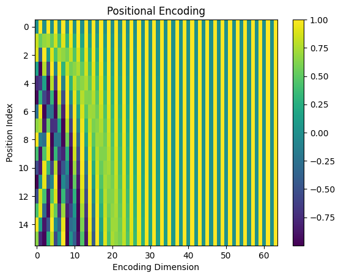
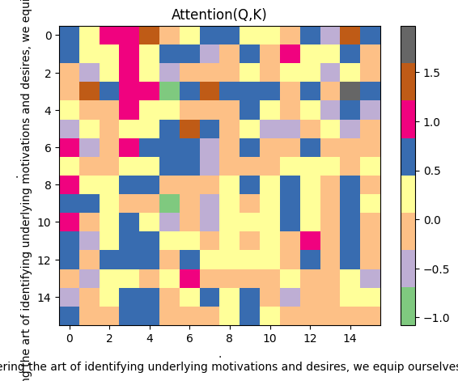
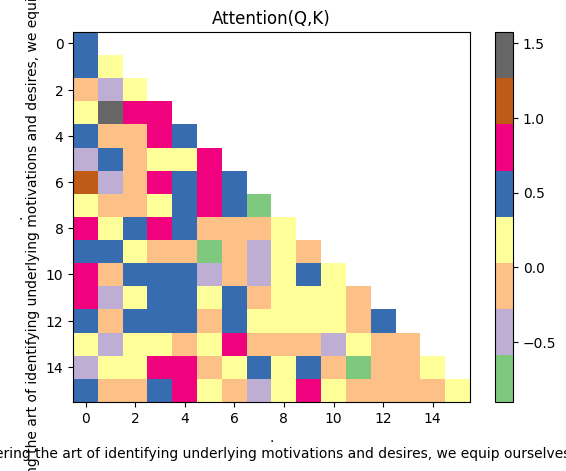

# Transformer from scratch

This is a **Transformer** based **Large Language Model (LLM)** training demo with only _~240 lines of code_.

Inspired by [nanoGPT](https://github.com/karpathy/nanoGPT), I wrote this demo to show how to train a LLM from scratch using PyTorch. 
The code is very simple and easy to understand. It's a good start point for beginners to learn how to train a LLM.

The demo is trained on a 450Kb [sample textbook](https://huggingface.co/datasets/goendalf666/sales-textbook_for_convincing_and_selling/raw/main/sales_textbook.txt) dataset, and the model size is about 51M. 
I trained on a single i7 CPU, and the training time takes about 20 minutes, result in approximately ~1.3M parameters.


# Get Started

1. Install dependencies

```
pip install numpy requests torch tiktoken
```
2. Run model.py

First time when you run it, the program will download the dataset and save to `data` folder.
Then the model will start training on the dataset. Training & validation `losses` will be printed on the console screen, something like:

``` 
Step: 0 Training Loss: 11.68 Validation Loss: 11.681
Step: 20 Training Loss: 10.322 Validation Loss: 10.287
Step: 40 Training Loss: 8.689 Validation Loss: 8.783
Step: 60 Training Loss: 7.198 Validation Loss: 7.617
Step: 80 Training Loss: 6.795 Validation Loss: 7.353
Step: 100 Training Loss: 6.598 Validation Loss: 6.789
...
```
 
The training loss will decrease as the training goes on. After 5000 iterations, the training will stop and the losses are down to around `2.807`. The model will be saved under name `model-ckpt.pt`.

Then a sample text will be generated and pop to the console screen from the model we just trained, something like:

```text
The salesperson to identify the other cost savings interaction towards a nextProps audience, and interactive relationships with them. Creating a genuine curiosityouraging a persuasive knowledge, focus on the customer's strengths and responding, as a friendly and thoroughly authority. 
Encouraging open communication style to customers that their values in the customer's individual finding the conversation.2. Addressing a harmoning ConcernBIG: Giving and demeanor is another vital aspect of practicing a successful sales interaction. By sharing case studies, addressing any this compromising clearly, pis
```

It looks pretty descent!

Feel free to change some of the hyperparameters on the top of the `model.py` file, and see how it affects the training process.

3. Step-by-step Jupyter Notebook

I also provide a step-by-step Jupyter Notebook `step-by-step.ipynb` to help you understand the architecture logic. To run this, you also need to insall:

```
pip install matplotlib pandas
```

This notebook prints out the intermediate results of each step followed by Transformer architecture from original paper, but only the **Decoder** part (Since GPT only use the decoder). So you can see how the model is trained each single step. For examples:

- what a [4,16] matrix of input embedding looks like:

```
      0     1      2      3     4      5      6      7      8      9      10     11     12     13     14     15
0    627  1383  88861    279  1989    315  25607  16940  65931    323  32097     11    584  26458  13520    449
1  15749   311   9615   3619   872   6444      6   3966     11  10742     11    323  32097     13   3296  22815
2  13189   315   1701   5557   304   6763    374  88861   7528  10758   7526     13   4314   7526   2997   2613
3    323  6376   2867  26470  1603  16661    264  49148    627     18     13  81745  48023  75311   7246  66044
```

- the positional encoding plot of the input sequence:




- the attention matrix of the first Q * K layer:




- after applying *Mask* attention of the above matrix:




# Other contents in this repo

Under `/GPT2` directory, I put some sample code to show how to fine-tune a pre-trained GPT2 model, as well as inference from it.


# If you want to dive deeper

As if you're new to LLM, I recommend you to read my blog post [Transformer Architecture: LLM From Zero-to-Hero](https://medium.com/@waylandzhang/transformer-architecture-llms-zero-to-hero-98b1ee51a838) , which breaks down the concepts of a Transformer architecture.

### References

- [nanoGPT](https://github.com/karpathy/nanoGPT) Andrej Karpathy's famous video tutorial on how to build a GPT model from scratch.
- [Transformers from Scratch](https://blog.matdmiller.com/posts/2023-06-10_transformers/notebook.html) A clear and easy implementation of Andrej's video contents by Mat Miller.
- [Attention is all you need](https://arxiv.org/abs/1706.03762) The original paper of Transformer architecture.
